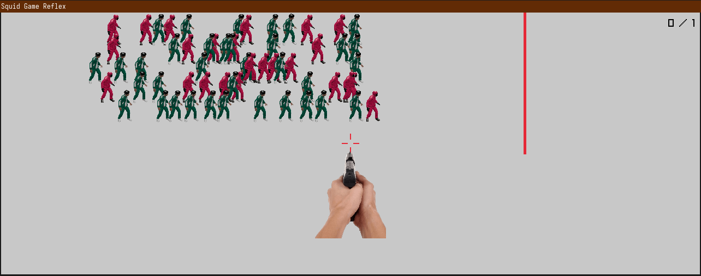

# Squid Game Reflex

Simple game to test your reflex inspired by the "Red Light, Green Light" challenge from Squid Game.



## Description

In this game, players must quickly identify and shoot the one player who continues to move when everyone else has stopped. 

## Requirements

- [Nim programming language](https://nim-lang.org/)
- [Raylib](https://www.raylib.com/) using the [naylib nim bindings](https://github.com/planetis-m/naylib)

## Installation

1. Ensure you have Nim installed on your system.
2. Install the Raylib Nim bindings:
   ```
   nimble install naylib
   ```
3. Clone this repository:
   ```
   git clone https://github.com/cletusigwe/squid-game-reflex.git
   cd squid-game-reflex
   ```

## Running the Game

To compile and run the game, use the following command:

```
nim c -r src/reflexTest.nim
```

## How to Play

1. The game starts with multiple characters moving across the screen.
2. When the "Red Light" sound plays, all characters should stop moving.
3. One character will continue to move - your job is to identify and shoot this character.
4. Use the mouse to aim the crosshair (hold CTRL to take control of the mouse).
5. Click or tap to shoot when the crosshair is over the moving character.
6. Your score increases if you successfully shoot the correct character.
7. The game continues with alternating "Green Light" (characters moving) and "Red Light" (characters stopping) phases.

## Controls

- Hold CTRL: Take control of the mouse/crosshair
- Mouse movement: Aim the crosshair
- Left-click or Tap: Shoot

## Resources

The game uses various resources (images and sounds) stored in the `../resources` directory. Ensure this directory is present and contains the necessary files:

- Images: `dikec.png`, `squid_game_sprites.png`
- Sounds: `shoot.mp3`, `stop.mp3`, `scanning.mp3`, `redlight_greenlight.mp3`

## License

This project is licensed under the MIT License.

## Acknowledgments

- Inspired by the "Red Light, Green Light" game from Squid Game
- Built using the Raylib library, using Naylib bindings
- Sounds from https://mixkit.co/free-sound-effects/gun/
- Squid Game Characters from https://dundy97.itch.io/squid-game-free-2d-character-pack